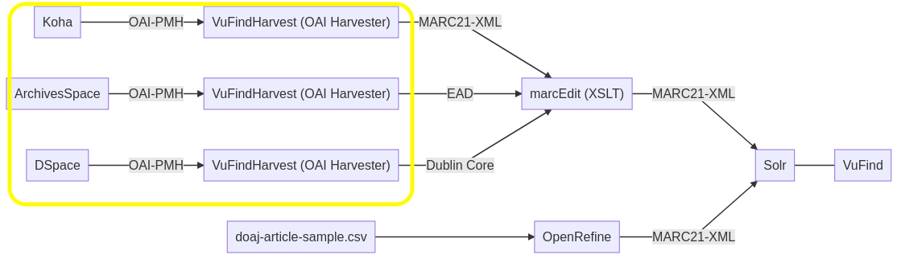

In der dritten Vorlesung zum Thema *Metadaten modellieren und Schnittstellen nutzen* lag unser Fokus auf den Austauschprotokollen, die bei Schnittstellen zum Einsatz kommen, sowie auf der Konvertierung von Metadaten. Wir haben praktische Übungen durchgeführt, bei denen wir zunächst Metadaten importierten und anschliessend konvertierten. In meinem Blog Beitrag werde ich die wesentlichen Inhalte dieser Vorlesung zusammenfassen und näher auf die durchgeführten Übungen eingehen.

## Schnittstellen und Austauschprotokolle für Metadaten

Um den Datenaustausch zwischen zwei unterschiedlichen Systemen zu ermöglichen, arbeitet man mit Schnittstellen. Diese Schnittstellen verwenden sogenannte Austauschprotokolle. Im Bibliotheks- und Archivbereich gibt es mehrere solcher Protkolle, drei bedeutende sind [Z39.50](https://www.loc.gov/z3950/agency/), [SRU](https://www.loc.gov/standards/sru/) (Search/Retrieve via URL) und [OAI-PMH](https://www.openarchives.org/pmh/) (Open Archives Initiative Protocol for Metadata Harvesting). Alle drei sind auf die Beteiligung der Library of Congress zurückzuführen. In der Vorlesung haben wir uns mit **OAI-PMH** genauer befasst, welches ein Austauschprotkoll ist, dass für grössere und regelmässige Datenabzüge geeignet ist. Es ermöglicht die Auswahl aus verschiedenen Metadatenformaten und den Abruf von Daten ab einem bestimmten Datum, sodass man mit Zeitstempeln arbeiten kann. Dadurch kann man Übertragungen auf dem neuesten Stand halten, indem man nur die geänderten oder neuen Daten in kleineren Mengen abruft.

Um selbstständig mal Metadaten über das Austauschprotokoll **OAI-PMH** zu harvesten (ernten), wurde uns ein Codespace mit einem vorbereiteten Repository auf GitHub zur Verfügung gestellt. Mit VuFindHarvest konnten wir Metadaten von den Systemen Koha, ArchiesSpaces und DSpace (alles Demoversionen davon) in VuFindHarvest importieren. Zuvor musste man dafür noch das vom Datenanbieter, also beispielsweise von ArchivesSpace, festgelte Prefix raussuchen. Mit diesem kdefiniert man das Metadatenformat im Befehl, welchen man zum importieren ausführt. Für ArchivesSpace könnte der Befehl wie folgt asusehen: 

```php bin/harvest_oai.php --url=https://sandbox.archivesspace.org/oai --metadataPrefix=oai_ead test-archivesspace```

Der gelb markierte Bereich zeigt nochmals den Import von Metadaten aus einem der drei Systeme — Koha, ArchivesSpace oder DSpace — in VuFindHarvest über das OAI-PMH-Austauschprotokoll.


![alt text][def]


## Konvertierung

Mit den gerade importierten Daten wird nun weitergearbeitet, diese sollen in einem weiteren Schritt aus ihren verschiedenen Ursprungsformaten einheitlich in das Datenformat MARC21-XML konvertiert werden. Dieser Prozess der Konvertierung unterschiedlicher Datenformate in ein einheitliches Format wird im Bibliotheks- und Archivwesen auch als *Crosswalk* bezeichnet.

Für die Konvertierung verwenden wir XSLT, das ist eine geeignete Programmiersprache für die Transformation von XML Dokumente. Die Libary of Congress bietet ein [Mapping](https://www.loc.gov/marc/marc2dc.html) an, in dem definiert wird, welche Felder beispielsweise von MARC21 in welche Felder von Dublin Core kopiert werden sollen. Für diese vordefinierten Regeln aus dem Mapping verwenden wir ein XSL Stylesheet (auch von der Libary of Congress), welches für die Transformation in einem [Transformationstool](http://xsltransform.net/) angewendet werden kann. Die zu transformierenden Ausgangsdaten sowie das XSL Stylesheet können in das Transformationstool eingefügt werden. Nach der Verarbeitung erhalten wir die transformierten Daten zurück. Für ein komplexeres XSL ist [MarcEdit](https://marcedit.reeset.net/) besser geeignet als das einfache Transformationstools [XSL Transform](http://xsltransform.net/). 

[def]: assets/image.png